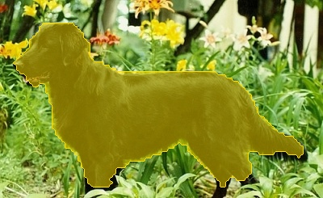
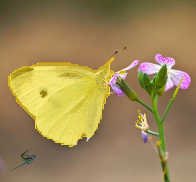
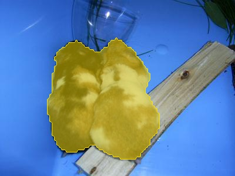

## Unsupervised Salient Object Detection with Spectral Cluster Voting [[L3D-IVU CVPRW 2022]](https://sites.google.com/view/l3d-ivu/)
[](https://paperswithcode.com/sota/unsupervised-saliency-detection-on-dut-omron?p=unsupervised-salient-object-detection-with)
[](https://paperswithcode.com/sota/unsupervised-saliency-detection-on-duts?p=unsupervised-salient-object-detection-with)
[](https://paperswithcode.com/sota/unsupervised-saliency-detection-on-ecssd?p=unsupervised-salient-object-detection-with)

This repo contains the code to reproduce the experiments results in the paper ["Unsupervised Salient Object Detection with Spectral Cluster Voting"](https://arxiv.org/pdf/2203.12614.pdf).

<p align="middle">
  
  
  
  
</p>

### Contents
* [Preparation](#preparation)
* [Training](#training)
* [Inference](#inference)
* [Pre-trained weights](#pre-trained-weights)
* [Citation](#citation)
* [Acknowledgements](#acknowledgements)

### Preparation
#### 1. Download datasets and pseudo-masks
To train/evaluate SelfMask, you first need to download some datasets.
For training, please download the [DUTS-TR dataset](http://saliencydetection.net/duts/download/DUTS-TR.zip) and its pseudo-masks (located at datasets/swav_mocov2_dino_p16_k234.json in this repo).
For evaluation, please download the [DUT-OMRON](http://saliencydetection.net/dut-omron/#org96c3bab), [DUTS-TE](http://saliencydetection.net/duts/download/DUTS-TE.zip), and [ECSSD](https://www.cse.cuhk.edu.hk/leojia/projects/hsaliency/dataset.html) datasets.
Please don't change the (sub)directory name(s) as the code assumes the original directory names.
We advise you to put the downloaded dataset(s) into the following directory structure for ease of implementation:
```bash
your_dataset_directory
├──DUTS
│  ├──DUTS-TE-Image
│  ├──DUTS-TE-Mask
│  ├──DUTS-TR-Image
├──DUTS-OMRON
│  ├──DUT-OMRON-image
│  ├──pixelwiseGT-new-PNG
├──ECSSD
   ├──images
   ├──ground_truth_mask

```

#### 2. Download the following python packages:
```
faiss-gpu==1.7.1
torch>=1.10
matplotlib==3.5.1
natsort==7.1.1
opencv==4.5.5
pycocotools==2.0.4
scikit-learn==1.0.2
scipy==1.7.3
timm==0.4.12
tqdm==4.63.0
ujson==4.2.0
wandb==0.12.11
pyyaml==6.0
```

### Training
Before running a training script, you need to set up some directory/file paths (e.g., dataset directory). For this please
open "duts-dino-k234-nq20-224-swav-mocov2-dino-p16-sr10100.yaml" file in configs directory and find "dir_ckpt", "dir_dataset", and "pseudo_masks_fp" arguments.
Then, type your corresponding paths:

```yaml
...
dir_ckpt: [YOUR_DESIRED_CHECKPOINT_DIR]
...
dir_dataset: [YOU_DATASET_DIR]
...
pseudo_masks_fp: [PATH_TO_DOWNLOADED_PSEUDO_MASKS_FILE]
...
```

To train a model with 20 queries from scratch, please move to the scripts directory and run
```shell
bash train-selfmask-nq20.sh
```
It is worth noting that, by default, the code will evaluate the model at the end of every epoch, stores the metric values (and the model weights if there was an improvement in terms of metrics).

### Inference
To run an inference of a pre-trained model, please run
```shell
python3 evaluator.sh --dataset_name $DATASET_NAME --p_state_dict $PATH_TO_WEIGHTS --config $PATH_TO_MODEL_CONFIG
```
Here, the config file is the configuration file used for pre-training.

### Pre-trained weights
We provide the pre-trained weights used for our experiments:

&nbsp;|# queries|IoU (%)|model|
:---:|:---:|:---:|:---:
SelfMask|10|64.5|[link](https://github.com/NoelShin/selfmask/releases/download/v1.0.0/selfmask_nq10.pt)
SelfMask|20|65.3|[link](https://github.com/NoelShin/selfmask/releases/download/v1.0.0/selfmask_nq20.pt)

IoUs are measured on the DUTS-TE benchmark.

### Citation
```
@article{shin2022selfmask,    
  author = {Gyungin Shin and Samuel Albanie and Weidi Wie},
  title = {Unsupervised Salient Object Detection with Spectral Cluster Voting},
  journal = {arXiv preprint arXiv:2203.12614},
  year = {2022}
}
```

### Acknowledgements
We borrowed the code for ViT, DINO, and MaskFormer from https://github.com/rwightman/pytorch-image-models, https://github.com/facebookresearch/dino, and https://github.com/facebookresearch/MaskFormer, respectively.

If you have any questions, please contact us at gyungin [at] robots [dot] ox [dot] ac [dot] uk.
